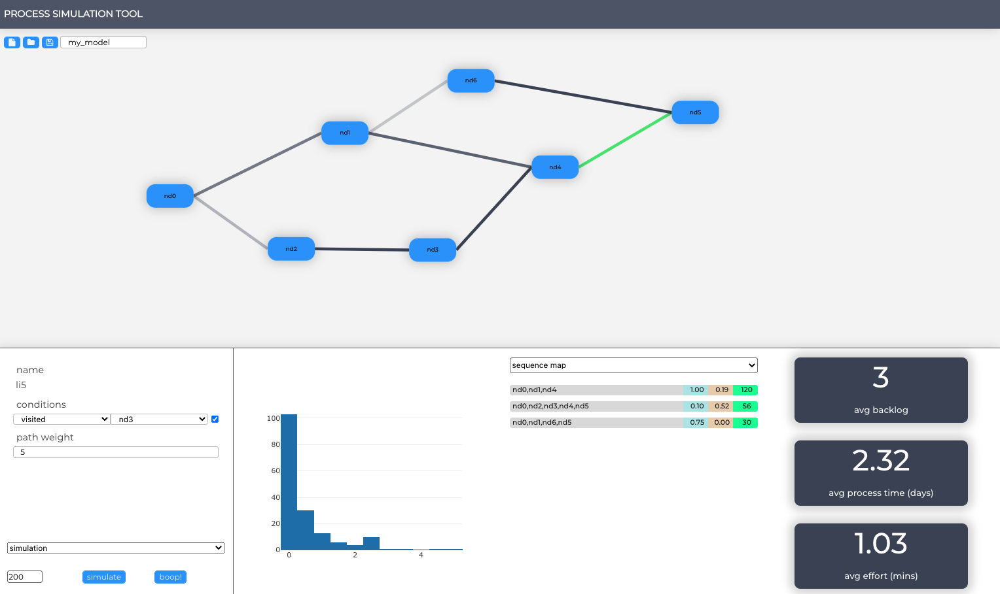

# Process Simulation Tool

## Introduction
The process simulator is a tool that allows users to investigate the impacts of policy/process/business changes via a simple click, drag and drop user interface.
Users are able to use the simulator to develop models. A model is represented by a set of processes and links between processes wherein each element of the model contains values configured by the user. These values dictate the eventual outputs of the model.

A model will output many values, for example:
- The average time it takes for an item of work to pass through the entire process
- The average staff effort involved in processing a piece of work
- Where backlogs occur
- Overall distributions of time taken to complete work

## Usage
### Create a new node
To create a new node (a discrete process within the model) select a source node (this will make the node turn green), then hold **Alt** and click anywhere on the canvas. This will result in a new node being created with a link to the source node.

### Linking existing nodes
Existing nodes can be linked together by selecting a source node then holding **Alt** and clicking on the node you wish to link to.
This will create a link between both nodes.

### Editing node parameters
A node is defined by the following:
- Its name
- *TODO* How likely it is to loop on itself (*self-loop weight*)
- The paramers defining its time distribution for processing time and effort 
    - distribution type
    - parameters 1 (usually the average time it takes to complete the process)
    - *TODO* paremeter 2 (usually 1)

> **EXAMPLE**  
A single process that take 15 minutes to complete by a service officer but spends 5 days on average in the system it should be coded by configuring its **process time settings to gamma - 5 - 1** and **operator time settings to gamma - 15 - 1**. 

### Editing link parameters
A link is defined by the following:
- Its name
- Any trasition conditions it has *(conditions)*
- The likelyhood of a piece of work flowing through it *(path weight)*

> **EXAMPLE**
A process which connects to two other processes where **process A occurs 30%** of the time and **process B occurs 70%** of the time should have the **path weight of the link to process A be set to 30** and the **path weight to process B set to 70**.

### Running the simulation
With **simulation** selected in the left side settings panel, set the number of tokens to simulate (a token is a single representation of a piece of work) then click **simulate**.
